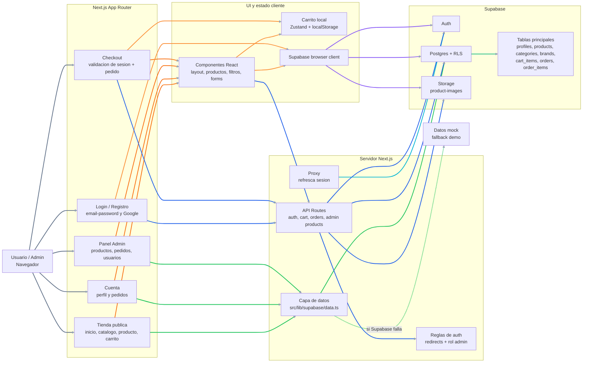

# AFCR Seguridad - Diagrama Simplificado

## Leyenda

- Gris: entrada del usuario a las secciones principales.
- Naranja: rutas que usan componentes y estado cliente.
- Naranja claro: carrito local y cliente browser de Supabase.
- Violeta: comunicacion directa del cliente con Supabase.
- Cian: refresco de sesion en el proxy.
- Verde: lecturas server con fallback mock.
- Azul: API routes y operaciones protegidas.
- Verde oscuro: estructura de base de datos.

## Resumen

La app es una tienda Next.js con rutas publicas, checkout, cuenta privada y panel admin. Lee datos desde Supabase mediante una capa server con fallback mock. El carrito visible vive en Zustand/localStorage. Las operaciones importantes, como crear ordenes o administrar productos, pasan por API routes protegidas y Supabase aplica RLS en la base de datos.
