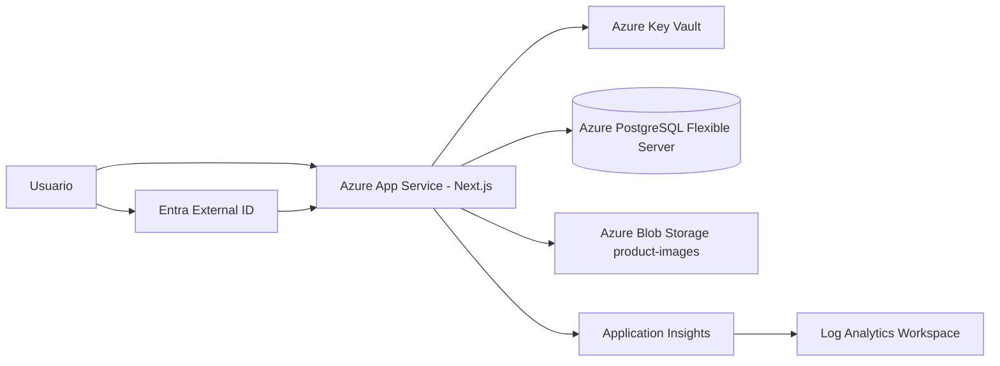
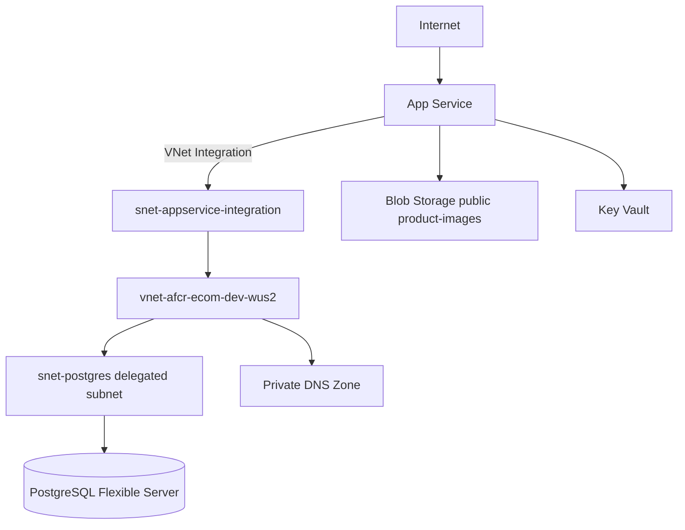
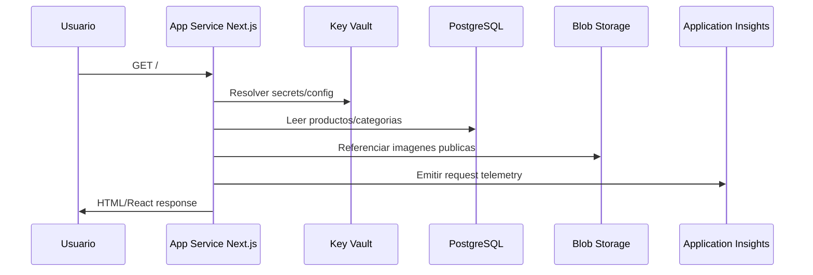
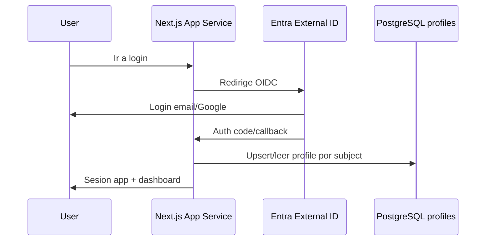
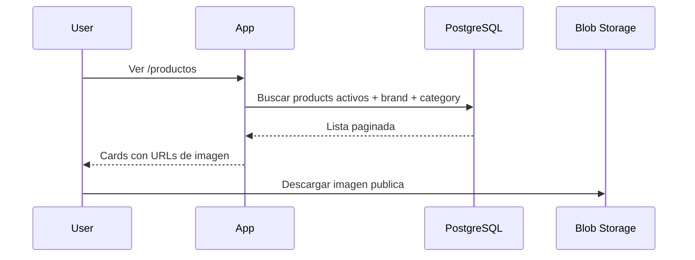
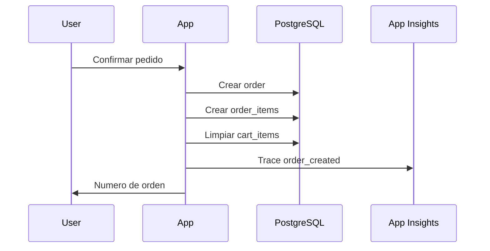
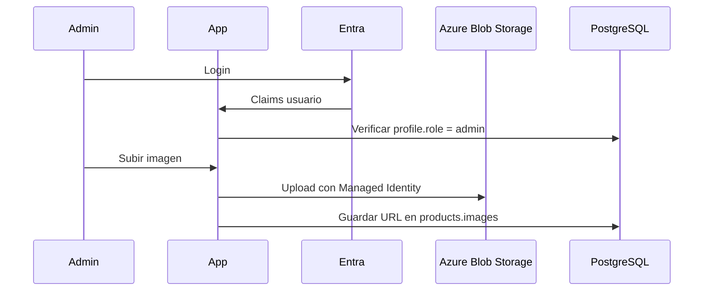
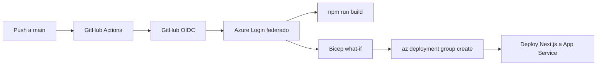

# Arquitectura Azure Para AFCR Seguridad E-commerce

## 1. Resumen Ejecutivo

La arquitectura propuesta migra la aplicacion actual desde Supabase hacia servicios Azure-native, manteniendo todos los recursos ARM de desarrollo dentro del Resource Group `ecommerce` en `westus2`.

Decisiones fijadas:

- Compute: Azure App Service para Next.js SSR y Route Handlers.
- Auth clientes: Microsoft Entra External ID.
- Base de datos: Azure Database for PostgreSQL Flexible Server.
- Imagenes: Azure Blob Storage.
- Secretos: Azure Key Vault.
- Observabilidad: Application Insights y Log Analytics.
- CI/CD: GitHub Actions con OIDC.
- Perfil dev: bajo costo, sin alta disponibilidad.

Excepcion necesaria: Entra External ID, app registrations y GitHub OIDC son configuraciones de identidad fuera del modelo de Resource Group. La regla sigue siendo que todos los recursos Azure desplegables por Bicep viven en `ecommerce`.

## 2. Estado Actual

La aplicacion actual es un e-commerce Next.js 16 con App Router, Route Handlers y SSR. Hoy depende de Supabase para:

- Auth de usuarios y admins.
- PostgreSQL para catalogo, perfiles, carrito persistido y pedidos.
- Storage publico `product-images` para imagenes de productos.
- RLS y politicas de acceso.

Tablas actuales a migrar:

```text
profiles
categories
brands
products
cart_items
orders
order_items
```

Resource Group de desarrollo ya preparado:

```text
Subscription: 3274731e-9035-49fa-9d05-11c978277669
Resource Group: ecommerce
Location: westus2
Codex identity: sp-codex-ecommerce-dev
Codex role: Contributor solo en ecommerce
```

Providers observados:

| Provider | Estado actual |
|---|---|
| `Microsoft.Web` | Registered |
| `Microsoft.Storage` | Registered |
| `Microsoft.Network` | Registered |
| `Microsoft.ManagedIdentity` | Registered |
| `Microsoft.DBforPostgreSQL` | NotRegistered |
| `Microsoft.KeyVault` | NotRegistered |
| `Microsoft.OperationalInsights` | NotRegistered |

Los providers `NotRegistered` deben registrarse una vez con un usuario Owner o una identidad con permisos de suscripcion. Codex no debe elevarse para hacerlo con su identidad limitada al Resource Group.

## 3. Recursos Azure A Desplegar

| Recurso | Nombre propuesto | SKU/dev | Proposito |
|---|---|---:|---|
| App Service Plan Linux | `plan-afcr-ecom-dev-wus2` | Basic B1 | Hospedar Next.js |
| Web App | `app-afcr-ecom-dev-<suffix>` | Node 22 LTS si esta disponible | SSR, Route Handlers, admin |
| PostgreSQL Flexible Server | `psql-afcr-ecom-dev-<suffix>` | Burstable B1ms, 32 GB | Datos ecommerce |
| PostgreSQL Database | `afcr_ecommerce` | N/A | Schema de la app |
| Storage Account | `stafcrecomdev<suffix>` | Standard LRS | Imagenes de productos |
| Blob Container | `product-images` | Public blob read | Imagenes visibles del catalogo |
| Key Vault | `kv-afcr-ecom-dev-<suffix>` | Standard | Secretos de DB, auth y pagos futuros |
| Log Analytics Workspace | `law-afcr-ecom-dev-wus2` | Pay-as-you-go | Logs centralizados |
| Application Insights | `appi-afcr-ecom-dev-wus2` | Workspace-based | Metricas, trazas y errores |
| VNet | `vnet-afcr-ecom-dev-wus2` | N/A | Red privada |
| Subnet App | `snet-appservice-integration` | N/A | Integracion de App Service con VNet |
| Subnet DB | `snet-postgres` | Delegada | PostgreSQL privado |
| Private DNS Zone | `privatelink.postgres.database.azure.com` | N/A | Resolucion privada para PostgreSQL |

Convenciones:

- `<suffix>` debe ser corto, estable y unico, por ejemplo los ultimos 6 caracteres de un hash de despliegue o un valor parametrizado.
- Storage Account debe cumplir reglas globales de Azure: minusculas, numeros, entre 3 y 24 caracteres.
- Todos los recursos deben llevar tags minimos: `app=afcr-ecommerce`, `env=dev`, `owner=abraham`, `managedBy=bicep`.

## 4. Identidad, Seguridad Y Acceso

### Identidades

| Identidad | Ambito | Uso |
|---|---|---|
| `sp-codex-ecommerce-dev` | `Contributor` solo en RG `ecommerce` | Trabajo asistido por Codex |
| `sp-github-ecommerce-dev` | Despliegue federado al RG `ecommerce` | GitHub Actions OIDC |
| Managed Identity de Web App | Recursos necesarios dentro del RG | Leer Key Vault, escribir Blob |
| Entra External ID | Tenant/configuracion CIAM | Login de clientes externos |

### Reglas

- Codex no usa tu usuario personal para desplegar.
- Codex no recibe `Owner`, `User Access Administrator` ni permisos RBAC.
- No hay despliegues a nivel de suscripcion.
- Todo despliegue de infraestructura usa `az deployment group` contra `ecommerce`.
- Todo secreto vive en Key Vault o fuera del repo.

### Key Vault

Secretos esperados:

```text
DATABASE_URL
POSTGRES_ADMIN_PASSWORD
ENTRA_EXTERNAL_ID_CLIENT_ID
ENTRA_EXTERNAL_ID_CLIENT_SECRET
ENTRA_EXTERNAL_ID_ISSUER
NEXTAUTH_SECRET
PAYMENT_PROVIDER_SECRET_FUTURE
```

La Web App debe consumir secretos mediante Key Vault references o Managed Identity. No se deben poner secretos en `appsettings` como texto plano si pueden referenciarse desde Key Vault.

## 5. Arquitectura Logica



## 6. Arquitectura De Red



Decisiones dev:

- PostgreSQL se planifica privado dentro de VNet.
- Blob `product-images` puede ser publico para lectura porque las imagenes del catalogo son publicas.
- Escritura a Blob solo desde backend/admin usando Managed Identity.
- Para produccion futura, evaluar private endpoint para Storage y servir imagenes via CDN/Front Door.

## 7. Flujos Funcionales

### Trafico Web



### Login Cliente



### Catalogo



### Checkout



### Upload Admin De Imagen



### CI/CD



## 8. Cambios Esperados En La Aplicacion

### Auth

- Reemplazar Supabase Auth por Entra External ID via OIDC.
- Implementar callbacks OIDC en Next.js.
- Mapear usuario externo a `profiles` usando el subject/issuer del token.
- Mantener `profile.role = 'admin'` como fuente de autorizacion de admin.
- Eliminar dependencia de `supabase.auth.getUser()` en servidor y cliente.

### Data Access

- Reemplazar `@supabase/supabase-js` y `@supabase/ssr`.
- Crear capa server-side para PostgreSQL.
- Evitar acceso directo a DB desde Client Components.
- Mantener fallback mock solo si se decide conservar modo demo local.

### Storage

- Migrar `product-images` de Supabase Storage a Azure Blob.
- Cambiar subida admin para que pase por Route Handler server-side.
- Web App usa Managed Identity para escribir en Blob.
- Guardar URLs finales en `products.images`.

### Configuracion

- Sustituir variables Supabase por variables Azure/OIDC/PostgreSQL.
- Consumir secretos desde Key Vault.
- Actualizar `next.config.ts` para permitir el dominio de Blob Storage o CDN/Front Door futuro.

## 9. Modelo De Datos Objetivo

Tablas base en PostgreSQL Azure:

```text
profiles
categories
brands
products
cart_items
orders
order_items
```

Adaptaciones respecto a Supabase:

- `profiles.id` ya no referencia `auth.users`; debe guardar un identificador propio y/o `external_subject`.
- Roles se mantienen en `profiles.role` con valores `customer` y `admin`.
- Las politicas RLS de Supabase se reemplazan por autorizacion en la capa API/server.
- Triggers de Supabase Auth se reemplazan por upsert de perfil durante callback/login.

## 10. Infraestructura Como Codigo

La carpeta `infra/` debe evolucionar asi:

```text
infra/
├── main.bicep
├── dev.bicepparam
├── modules/
│   ├── app-service.bicep
│   ├── postgres.bicep
│   ├── storage.bicep
│   ├── key-vault.bicep
│   ├── monitoring.bicep
│   └── network.bicep
└── azure-architecture.md
```

Reglas:

- `targetScope = 'resourceGroup'`.
- No crear Resource Groups desde Bicep.
- No crear asignaciones `Owner` o RBAC admin.
- Ejecutar siempre `what-if` antes de `create`.
- No versionar secretos ni outputs sensibles.

## 11. Fases De Implementacion

1. Registrar providers faltantes con usuario Owner:
   - `Microsoft.DBforPostgreSQL`
   - `Microsoft.KeyVault`
   - `Microsoft.OperationalInsights`
2. Extender Bicep con red, App Service, PostgreSQL, Storage, Key Vault y observabilidad.
3. Crear Entra External ID y app OIDC para clientes.
4. Crear GitHub OIDC con identidad `sp-github-ecommerce-dev`.
5. Migrar capa de datos desde Supabase a PostgreSQL Azure.
6. Migrar imagenes a Blob Storage.
7. Actualizar variables, Key Vault references y `next.config.ts`.
8. Ejecutar `what-if`, revisar y desplegar en `ecommerce`.
9. Probar login, catalogo, admin, subida de imagenes, carrito y checkout.

## 12. Validaciones

Infraestructura:

```bash
az deployment group what-if \
  --resource-group ecommerce \
  --template-file infra/main.bicep \
  --parameters infra/dev.bicepparam
```

Aplicacion:

```bash
npm run build
npm run lint
```

Smoke tests:

- Home carga productos.
- Catalogo filtra y ordena.
- Login redirige a Entra External ID.
- Usuario autenticado accede a cuenta.
- Admin crea/edita producto.
- Admin sube imagen a Blob.
- Checkout crea pedido.
- Application Insights recibe trazas y errores.

Seguridad:

- `sp-codex-ecommerce-dev` solo tiene `Contributor` en `ecommerce`.
- `sp-github-ecommerce-dev` solo despliega desde `main`.
- Web App puede leer Key Vault y escribir Blob con Managed Identity.
- No hay secretos en repo, logs ni outputs de CI.

## 13. Ruta Futura A Produccion

Produccion no debe reutilizar `ecommerce`. Debe tener Resource Group, identidades y secretos separados.

Recomendaciones:

- App Service Premium con deployment slots.
- PostgreSQL HA, backups ampliados y alertas.
- Azure Front Door Standard/Premium con WAF.
- Key Vault con purge protection.
- Storage privado con CDN/Front Door.
- CI/CD con aprobacion manual antes de produccion.
- Alertas de disponibilidad, errores 5xx, CPU, memoria, conexiones DB y uso de storage.

## 14. Riesgos Y Mitigaciones

| Riesgo | Mitigacion |
|---|---|
| Migrar Auth desde Supabase rompe sesiones | Hacer migracion por fases y mantener rollback |
| RLS desaparece al salir de Supabase | Mover autorizacion a Route Handlers/server-side |
| Blob publico expone rutas de imagen | Solo usar container publico para catalogo, no datos privados |
| Costos crecen por recursos siempre activos | Usar SKUs dev bajos y revisar budgets |
| Provider no registrado bloquea despliegue | Registrar providers antes del primer despliegue |
| Secretos filtrados en CI | OIDC + Key Vault, sin secretos largos en GitHub |

## 15. Referencias Oficiales

- Azure App Service: https://learn.microsoft.com/en-us/azure/app-service/overview
- PostgreSQL Flexible Server: https://learn.microsoft.com/en-us/azure/postgresql/flexible-server/overview
- Entra External ID: https://learn.microsoft.com/en-us/entra/external-id/customers/overview-customers-ciam
- GitHub OIDC con Azure: https://learn.microsoft.com/en-us/azure/developer/github/connect-from-azure-openid-connect
- Key Vault references en App Service: https://learn.microsoft.com/en-us/azure/app-service/app-service-key-vault-references
